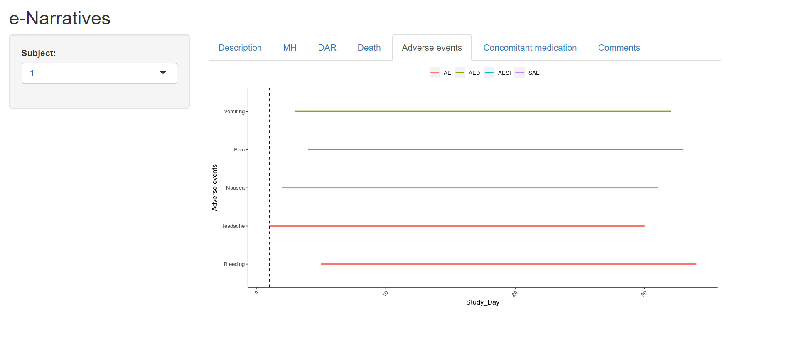

# e-Narratives
Patient narratives or stories are accounts told in a patient’s own words during clinical trails

e-Narrative application will help you understand the patient story in tabular and visualize format.

Please use the below link to deep dive some patient stories.

https://arun-kumar-mahesh.shinyapps.io/e-Narratives/ 
